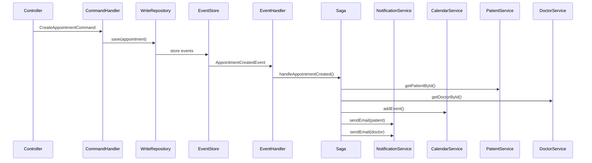
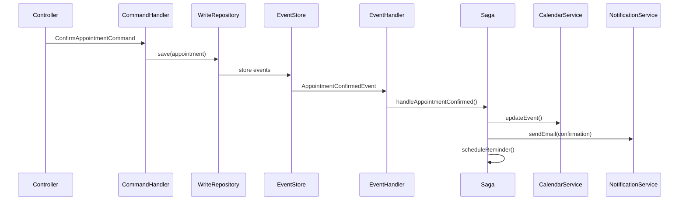

# Event-Driven Architecture avec Sagas

## 🎯 Qu'est-ce qu'une Saga ?

Une **Saga** est un pattern qui orchestre des processus métier distribués en utilisant des événements. Elle gère les transactions distribuées et assure la cohérence des données à travers plusieurs services.

## 🏗️ Architecture Event-Driven avec Sagas

```
┌─────────────────────────────────────────────────────────────────┐
│                        DOMAIN EVENTS                           │
├─────────────────────────────────────────────────────────────────┤
│  AppointmentCreatedEvent                                        │
│  AppointmentConfirmedEvent                                      │
│  AppointmentCancelledEvent                                      │
└─────────────────────────────────────────────────────────────────┘
                                │
                                ▼
┌─────────────────────────────────────────────────────────────────┐
│                        SAGA ORCHESTRATOR                       │
├─────────────────────────────────────────────────────────────────┤
│  AppointmentSaga                                               │
│  ├── handleAppointmentCreated()                                │
│  ├── handleAppointmentConfirmed()                              │
│  └── handleAppointmentCancelled()                              │
└─────────────────────────────────────────────────────────────────┘
                                │
                                ▼
┌─────────────────────────────────────────────────────────────────┐
│                    EXTERNAL SERVICES                           │
├─────────────────────────────────────────────────────────────────┤
│  ┌─────────────┐  ┌─────────────┐  ┌─────────────┐  ┌─────────┐ │
│  │Notification │  │  Calendar   │  │  Patient    │  │ Doctor  │ │
│  │  Service    │  │  Service    │  │  Service    │  │ Service │ │
│  └─────────────┘  └─────────────┘  └─────────────┘  └─────────┘ │
└─────────────────────────────────────────────────────────────────┘
```

## 🔄 Flux d'une Saga

### 1. Création d'un Rendez-vous



### 2. Confirmation d'un Rendez-vous



## 🛡️ Gestion des Erreurs et Compensation

### Principe de Compensation

Quand une étape de la saga échoue, on doit compenser (annuler) les actions précédentes :

```typescript
async handleAppointmentCreated(event: AppointmentCreatedEvent): Promise<void> {
  try {
    // 1. Récupérer les informations
    const [patient, doctor] = await Promise.all([
      this.patientService.getPatientById(appointment.patientId),
      this.doctorService.getDoctorById(appointment.doctorId),
    ]);

    // 2. Ajouter au calendrier
    await this.calendarService.addEvent(appointment.doctorId, appointment);

    // 3. Envoyer les notifications
    await this.notificationService.sendEmail(patient.email, ...);
    await this.notificationService.sendEmail(doctor.email, ...);

  } catch (error) {
    // Compensation : nettoyer ce qui a été fait
    await this.handleAppointmentCreationFailure(appointment, error);
  }
}

private async handleAppointmentCreationFailure(appointment: any, error: any): Promise<void> {
  try {
    // Annuler l'ajout au calendrier
    await this.calendarService.removeEvent(appointment.doctorId, appointment.id);
  } catch (cleanupError) {
    // Log l'erreur de compensation
    console.error('Erreur lors de la compensation:', cleanupError);
  }
}
```

## 📊 Avantages des Sagas

### 1. **Orchestration de Services Distribués**
- Coordonne plusieurs services externes
- Gère les dépendances entre services
- Assure la cohérence des données

### 2. **Gestion des Erreurs**
- Compensation automatique en cas d'échec
- Rollback des actions effectuées
- Logs détaillés pour le debugging

### 3. **Flexibilité**
- Ajout facile de nouveaux services
- Modification des processus métier
- Tests unitaires simplifiés

### 4. **Observabilité**
- Traçabilité complète des processus
- Métriques de performance
- Monitoring des erreurs

## 🔧 Implémentation Technique

### Saga Handler

```typescript
@EventsHandler(AppointmentCreatedEvent)
export class AppointmentCreatedSagaHandler implements IEventHandler<AppointmentCreatedEvent> {
  constructor(private readonly appointmentSaga: AppointmentSaga) {}

  async handle(event: AppointmentCreatedEvent) {
    await this.appointmentSaga.handleAppointmentCreated(event);
  }
}
```

### Services Externes

```typescript
export interface INotificationService {
  sendEmail(to: string, subject: string, body: string): Promise<void>;
  sendSMS(to: string, message: string): Promise<void>;
}

export interface ICalendarService {
  addEvent(doctorId: string, appointment: any): Promise<void>;
  removeEvent(doctorId: string, appointmentId: string): Promise<void>;
  updateEvent(doctorId: string, appointment: any): Promise<void>;
}
```

## 🚀 Évolutions Futures

### 1. **Saga State Management**
```typescript
export interface ISagaState {
  sagaId: string;
  status: 'RUNNING' | 'COMPLETED' | 'FAILED' | 'COMPENSATING';
  currentStep: number;
  data: any;
  createdAt: Date;
  updatedAt: Date;
}
```

### 2. **Saga Persistence**
```typescript
@Injectable()
export class SagaStateRepository {
  async saveState(state: ISagaState): Promise<void> {
    // Sauvegarder l'état de la saga
  }

  async getState(sagaId: string): Promise<ISagaState | null> {
    // Récupérer l'état de la saga
  }
}
```

### 3. **Saga Recovery**
```typescript
@Injectable()
export class SagaRecoveryService {
  async recoverFailedSagas(): Promise<void> {
    // Récupérer et relancer les sagas en échec
  }
}
```

### 4. **Event Streaming**
```typescript
// Kafka pour la communication entre services
@EventsHandler(AppointmentCreatedEvent)
export class AppointmentCreatedSagaHandler {
  async handle(event: AppointmentCreatedEvent) {
    await this.kafkaProducer.send('appointment-saga-events', {
      type: 'APPOINTMENT_CREATED',
      data: event,
      sagaId: generateSagaId(),
    });
  }
}
```

## 📈 Monitoring et Observabilité

### Métriques à Surveiller

- **Taux de succès des sagas**
- **Temps d'exécution moyen**
- **Nombre de compensations**
- **Latence des services externes**

### Logs Structurés

```typescript
console.log('Saga started', {
  sagaId: 'saga-123',
  eventType: 'APPOINTMENT_CREATED',
  appointmentId: 'app-456',
  timestamp: new Date().toISOString(),
});
```

Cette architecture event-driven avec sagas permet de gérer des processus métier complexes de manière fiable et observable, tout en maintenant la cohérence des données à travers plusieurs services.
